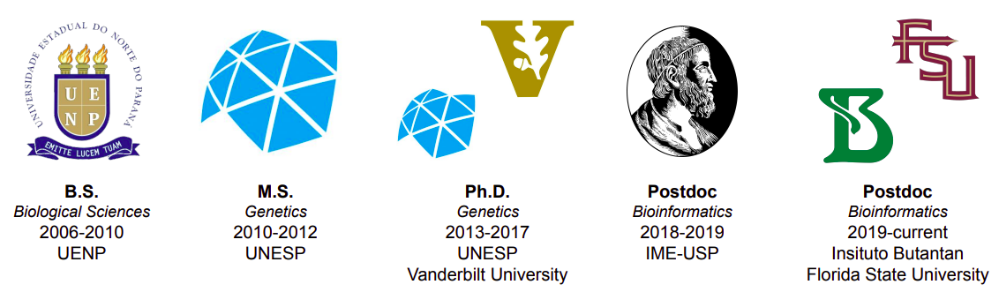

<h1>Pedro G. Nachtigall, Ph.D.</h1>
<h3>Bioinformatics||Evolution||Genetics</h3>

## About me

I like to design novel tools and integrate available approaches to convert data into biological knowledge. I consider myself a computational biologist with highly enthusiasm of using and integrating novel technologies to study evolution, ecology, and genetics. Currently, I am using high-throughput sequencing methodologies to better understand venom evolution in snakes.

I have 10+ years of experience in bioinformatics, statistics, programming, software engineering, pipeline development, and high-throughput sequencing data analysis. I have a wide experience in a variety of 'omic' data (genomics, epigenomics, transcriptomics, and proteomics) generated by short- and/or long-reads methodologies.

<!--
## Repositories

Find below a list of the repositories containing tools, scripts, tutorials, and guides that I've been developed so far.

### Tools

### Bioinformatics pipelines/tutorials/guides

-->

# Contact
:mailbox: pedronachtigall@gmail.com

<!--
**pedronachtigall/pedronachtigall** is a ✨ _special_ ✨ repository because its `README.md` (this file) appears on your GitHub profile.

Here are some ideas to get you started:

- 🔭 I’m currently working on ...
- 🌱 I’m currently learning ...
- 👯 I’m looking to collaborate on ...
- 🤔 I’m looking for help with ...
- 💬 Ask me about ...
- 📫 How to reach me: ...
- 😄 Pronouns: ...
- ⚡ Fun fact: ...
-->
