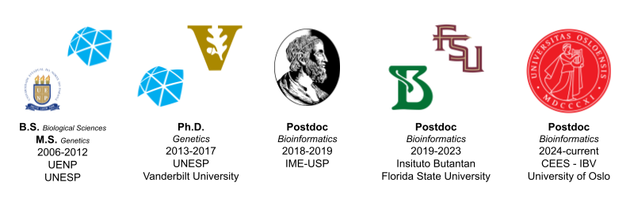

<h1>Pedro G. Nachtigall, Ph.D.</h1>
<h3>Bioinformatics || Evolution || Genetics</h3>
 

## About me

I like to design novel tools and integrate available approaches to convert data into biological knowledge. I consider myself a computational biologist with high enthusiasm of using and integrating novel technologies to study evolution, ecology, and genetics. Currently, I am using high-throughput sequencing methodologies to better understand venom evolution in snakes.

I have 10+ years of experience in bioinformatics, statistics, programming, software engineering, pipeline development, and high-throughput sequencing data analysis. I have a wide experience in a variety of 'omic' data (genomics, epigenomics, transcriptomics, and proteomics) generated by short- and/or long-reads methodologies.

<!--  -->

## Repositories

Find below a list of the repositories containing tools, scripts, tutorials, and guides that I've been developed so far.

### Tools

- [CodAn](https://github.com/pedronachtigall/CodAn)
- [ToxCodAn](https://github.com/pedronachtigall/ToxCodAn)
- [ToxCodAn-Genome](https://github.com/pedronachtigall/ToxCodAn-Genome)
- [MITGARD](https://github.com/pedronachtigall/MITGARD)
- [MitoSIS](https://github.com/pedronachtigall/MitoSIS)
- [UTRan](https://github.com/pedronachtigall/UTRan)
- [denomiR](https://github.com/pedronachtigall/denomiR)
- [cirCodAn](https://github.com/pedronachtigall/cirCodAn)

### Bioinformatics tutorials/guides

 - [Guide to venom gland transcriptomics](https://github.com/pedronachtigall/ToxCodAn/tree/master/Guide)
 - [Guide to annotate toxin genes in genomes](https://github.com/pedronachtigall/ToxCodAn-Genome/tree/main/Guide)
 - [Tutorial to perform chromosome-level genome assembly using HiFi and HiC data](https://github.com/pedronachtigall/HI-genome-assembly-pipeline)
 - [Tutorial to perform repeat annotation in genome assemblies](https://github.com/pedronachtigall/Repeat-annotation-pipeline)

## Contact
:mailbox: pedronachtigall@gmail.com

<!--
**pedronachtigall/pedronachtigall** is a ✨ _special_ ✨ repository because its `README.md` (this file) appears on your GitHub profile.

Here are some ideas to get you started:

- 🔭 I’m currently working on ...
- 🌱 I’m currently learning ...
- 👯 I’m looking to collaborate on ...
- 🤔 I’m looking for help with ...
- 💬 Ask me about ...
- 📫 How to reach me: ...
- 😄 Pronouns: ...
- ⚡ Fun fact: ...
-->
